In this tutorial you follow the steps of the When-to-Worry-and-How-to-Avoid-the-Misuse-of-Bayesian-Statistics - checklist [(the WAMBS-checklist)](https://www.rensvandeschoot.com/wambs-checklist/)

  <p>&nbsp;</p>

## Preparation

This tutorial expects:

- Version 8 or higher of [Mplus](https://sourceforge.net/projects/mcmc-jags/files/latest/download?source=files).This tutorial was made using Mplus version 8_3.
- Basic knowledge of hypothesis testing
- Basic knowledge of correlation and regression
- Basic knowledge of [Bayesian](https://www.rensvandeschoot.com/a-gentle-introduction-to-bayesian-analysis-applications-to-developmental-research/) inference
- Basic knowledge of coding in Mplus


[expand title="Check the WAMBS checklist here" trigclass="noarrow my_button" targclass="my_content" tag="button"]


## **WAMBS checklist** 

### *When to worry, and how to Avoid the Misuse of Bayesian Statistics*

**To be checked before estimating the model**

1. Do you understand the priors?

**To be checked after estimation but before inspecting model results**

2.    Does the trace-plot exhibit convergence?
3.  Does convergence remain after doubling the number of iterations?
4.   Does the posterior distribution histogram have enough information?
5.   Do the chains exhibit a strong degree of autocorrelation?
6.   Do the posterior distributions make substantive sense?

**Understanding the exact influence of the priors**

7. Do different specification of the multivariate variance priors influence the results?
8.   Is there a notable effect of the prior when compared with non-informative priors?
9.   Are the results stable from a sensitivity analysis?
10.   Is the Bayesian way of interpreting and reporting model results used?


[/expand]

  <p>&nbsp;</p>


## Example Data

The data we will be using for this exercise is based on a study about predicting PhD-delays ([Van de Schoot, Yerkes, Mouw and Sonneveld 2013](http://journals.plos.org/plosone/article?id=10.1371/journal.pone.0068839)).The data can be downloaded [here](https://www.rensvandeschoot.com/wp-content/uploads/2018/10/phd-delays_nonames.csv). Among many other questions, the researchers asked the Ph.D. recipients how long it took them to finish their Ph.D. thesis (n=333). It appeared that Ph.D. recipients took an average of 59.8 months (five years and four months) to complete their Ph.D. trajectory. The variable B3_difference_extra measures the difference between planned and actual project time in months (mean=9.97, minimum=-31, maximum=91, sd=14.43). For more information on the sample, instruments, methodology and research context we refer the interested reader to the paper.

For the current exercise we are interested in the question whether age (M = 31.7, SD = 6.86) of the Ph.D. recipients is related to a delay in their project.

The relation between completion time and age is expected to be non-linear. This might be due to that at a certain point in your life (i.e., mid thirties), family life takes up more of your time than when you are in your twenties or when you are older.

So, in our model the $gap$ (*B3_difference_extra*) is the dependent variable and $age$ (*E22_Age*) and $age^2$(*E22_Age_Squared *) are the predictors. The data can be found in the file <span style="color:red"> ` phd-delays_nonames.csv` </span>. (In Mplus the first row CANNOT have the variable names, these have already been deleted for you)
  
  
  <p>&nbsp;</p>

##### _**Question:** Write down the null and alternative hypotheses that represent this question. Which hypothesis do you deem more likely?_

[expand title="Answer" trigclass="noarrow my_button" targclass="my_content" tag="button"]

$H_0:$ _$age$ is not related to a delay in the PhD projects._

$H_1:$ _$age$ is related to a delay in the PhD projects._ 

$H_0:$ _$age^2$ is not related to a delay in the PhD projects._

$H_1:$ _$age^2$ is related to a delay in the PhD projects._ 

[/expand]


## Preparation - Importing and Exploring Data


You can find the data in the file <span style="color:red"> ` phd-delays_nonames.csv` </span>, which contains all variables that you need for this analysis. Although it is a .csv-file, you can directly load it into Mplus using the following syntax:


```r
TITLE: Bayesian analysis summary
DATA: FILE IS phd-delays_nonames.csv;
VARIABLE: NAMES ARE diff child sex Age Age2;
USEVARIABLES ARE diff Age Age2;
OUTPUT: sampstat;
```

Once you loaded in your data, it is advisable to check whether your data import worked well. Therefore, first have a look at the summary statistics of your data. You can do this by looking at the `sampstat` ouput. 

<p>&nbsp;</p>


##### _**Question:** Have all your data been loaded in correctly? That is, do all data points substantively make sense? If you are unsure, go back to the .csv-file to inspect the raw data._

[expand title="Answer" trigclass="noarrow my_button" targclass="my_content" tag="button"]


```r
MODEL RESULTS

                                                    Two-Tailed
                    Estimate       S.E.  Est./S.E.    P-Value

 Means
    DIFF               9.967      0.790     12.622      0.000
    AGE               31.676      0.375     84.433      0.000
    AGE2            1050.217     35.916     29.241      0.000
```


_The descriptive statistics make sense:_

_$diff$: Mean (9.97), SE (0.790)_

_$Age$: Mean (31.68), SE (0.38)_

_$Age^2$: Mean (1050.22), SE (35.92)_

[/expand]

  <p>&nbsp;</p>
  
##   **Step 1: Do you understand the priors?**

  <p>&nbsp;</p>
  
### 1.Do you understand the priors?


Before actually looking at the data we first need to think about the prior distributions and hyperparameters for our model. For the current model, there are four priors:

- the intercept
- the two regression parameters ($\beta_1$ for the relation with AGE and $\beta_2$ for the relation with AGE2)
- the residual variance ($\in$)

We first need to determine which distribution to use for the priors. Let&#39;s use for the

- intercept a normal prior with $\mathcal{N}(\mu_0, \sigma^{2}_{0})$, where $\mu_0$ is the prior mean of the distribution and $\sigma^{2}_{0}$ is the variance parameter
- $\beta_1$ a normal prior with $\mathcal{N}(\mu_1, \sigma^{2}_{1})$
- $\beta_2$ a normal prior with $\mathcal{N}(\mu_2, \sigma^{2}_{2})$
- $\in$ an Inverse Gamma distribution with $IG(\kappa_0,\theta_0)$, where $\kappa_0$ is the shape parameter of the distribution and $\theta_0$ the rate parameter

Next, we need to specify actual values for the hyperparameters of the prior distributions. Let&#39;s say we found a previous study and based on this study the following hyperparameters can be specified:

- intercept $\sim \mathcal{N}(-35, 20)$
- $\beta_1 \sim \mathcal{N}(.8, 5)$
- $\beta_2 \sim \mathcal{N}(0, 10)$
- $\in \sim IG(.5, .5)$ This is an uninformative prior for the residual variance, which has been found to perform well in simulation studies.


It is a good idea to plot these distribution to see how they loo and waht expected delay would be given these priors. With these priors the regression formula would be: $delay=-35+ .8*age + 0*age^2$. In the Blavaan version of the WAMBS checklist we explain how you can easily do that in R. 

To run a multiple regression with Mplus, you first specify the model (after the `MODEL line` using the `ON command` for regression coefficients, and the `[]`  command for the intercept/means). As default Mplus does not run a Bayesian analysis, so you would have to change the `ESTIMATOR` to `BAYES` under `ANALYSIS` in the input file and then look at the output under `MODEL RESULTS`. In Mplus, the priors are set in the under the `MODEL PRIORS` command using the `~` sign, an `N` for a normal distribution, and an `IG` for the inverse gamma distribution. To see what default priors Mplus uses we can have a look at the Appendix A of this [manual](https://www.statmodel.com/download/BayesAdvantages18.pdf). 

The priors are presented in code as follows:


```r
TITLE: Bayesian analysis;

DATA: FILE IS phd-delays_nonames.csv;

VARIABLE: NAMES ARE diff child sex Age Age2; ! All the variables in the dataset

USEVARIABLES ARE diff Age Age2; ! The variables we use in this analysis

ANALYSIS:
ESTIMATOR IS bayes; ! Specify that we want to use a Bayesian analysis
Bseed = 23082018; !specify a seed value for reproducing the results
CHAINS = 3; ! set the number of chains we want to use

MODEL: 
[diff] (intercept);       ! specify that we want an intercept
! this model would also work without this line, but this way it is possible to easily set a prior
diff ON Age (Beta_Age);   ! Regression coefficient 1. 
diff ON Age2(Beta_Age2);  ! Regression coefficient 2 
! You need to name these regression coefficients to later set priors
diff (e);                 ! Error variance

MODEL PRIORS:
  Beta_Age ~ N(.8, 5); ! These are the different priors
  Beta_Age2 ~ N(0, 10);
  intercept ~  N(-35, 20);
  e ~ IG(0.5, 0.5);


OUTPUT: 
  cinterval(hpd); !to request CIs based on higher posterior density intervals
  tech8; !to request additional information about priors and convergence
  
PLOT: 
    TYPE IS PLOT2; !to request for plots
```


To check the prior distribution in Mplus you have to first run the analysis adding `PLOT: TYPE IS PLOT2;` to the input file. Then, in the top menu of Mplus,  go to `Plot > View Plots >  Bayesian prior parameter distribution > view > select the parameter you would like to see the prior of > kernel density > OK`
Inspect all priors. (Be careful the actual density you see, is the density of the posterior, the prior is summarized in the different coloured lines. This seems to be a bit of a bug in Mplus)


[expand title="Answer" trigclass="noarrow my_button" targclass="my_content" tag="button"]

*As an example the prior distribution of the regression coefficient for age*

[/expand]


### **Step 2: Run the model and check for convergence**


To run a multiple regression in Mplus with a specific number of iteratation, you first specify the model as before but add `FBITERATIONS = xxx;` to the `ANALYSIS` part of the input file.

### 2. Does the trace-plot exhibit convergence?


By default Mplus discards half of the iteration  as burnin period. After running this model we can check the trace plots by going to `Plot > View Plots >  Bayesian posterior parameter trace plots > view > select the parameter you would like to see the prior of > OK`

First, run the model with only 100 iterations. Inspect the traceplots, what do you conclude?

[expand title="Answer" trigclass="noarrow my_button" targclass="my_content" tag="button"]


```r
TITLE: Bayesian analysis;

DATA: FILE IS phd-delays_nonames.csv;

VARIABLE: NAMES ARE diff child sex Age Age2; ! All the variables in the dataset

USEVARIABLES ARE diff Age Age2; ! The variables we use in this analysis

ANALYSIS:
ESTIMATOR IS bayes; ! Specify that we want to use a Bayesian analysis
Bseed = 23082018; !specify a seed value for reproducing the results
CHAINS = 3; ! set the number of chains we want to use
FBITERATIONS = 100 ! this is how we set the number of iterators

MODEL: 
[diff] (intercept);       ! specify that we want an intercept
! this model would also work without this line, but this way it is possible to easily set a prior
diff ON Age (Beta_Age);   ! Regression coefficient 1. 
diff ON Age2(Beta_Age2);  ! Regression coefficient 2 
! You need to name these regression coefficients to later set priors
diff (e);                 ! Error variance

MODEL PRIORS:
  Beta_Age ~ N(.8, 5); ! These are the different priors
  Beta_Age2 ~ N(0, 10);
  intercept ~  N(-35, 20);
  e ~ IG(0.5, 0.5);


OUTPUT: 
  cinterval(hpd); !to request CIs based on higher posterior density intervals
  tech8; !to request additional information about priors and convergence
  
PLOT: 
    TYPE IS PLOT2; !to request for plots
```


**trace plot age** 
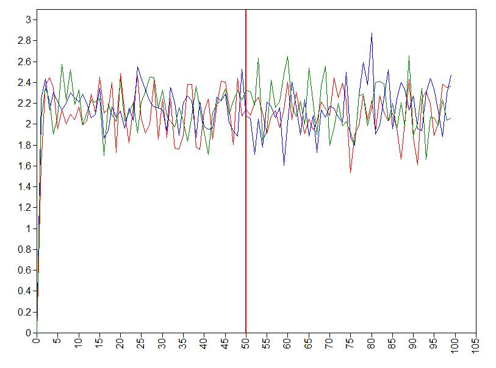

Clearly, two times 50 iterations is not enough for obtaining trusthworthy results and we need more iterations.

[/expand]

Let's specify a fixed number of iterations by adding `FBITERATIONS = 2000;` to the `ANALYSIS` part. Inspect the traceplots again.

[expand title="Answer" trigclass="noarrow my_button" targclass="my_content" tag="button"]


**trace plot intercept** 
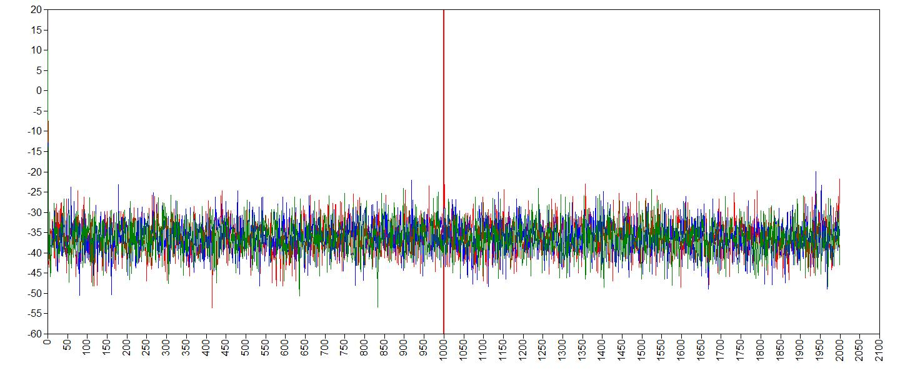

**trace plot age** 
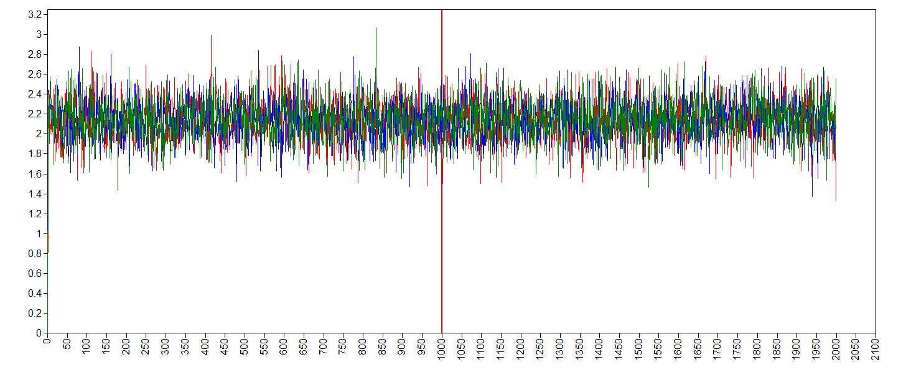


First we run the anlysis with a urnin period of 1000 samples and then take another 1000  samples. 

**trace plot age^2** 
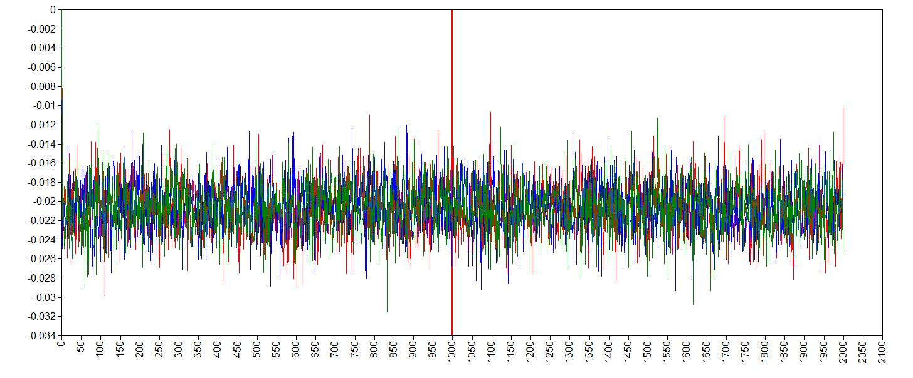


**trace plot error variance** 


It seems like the trace (caterpillar) plots are  neatly converged into one each other (we ideally want one fat caterpillar). This  indicates we already have enough samples.


We can double check check if the chains converged by having a look at the convergence diagnostics, the Gelman and Rubin diagnostic. To have a look at the Gelman-Rubin Diagnostic (PSRF) we can check this table under the `TECH8`outout of Mplus. The Gelman-Rubin Diagnostic shows the PSRF values (using the  within and between chain variability), which should be close to 1 for ALL iterations after burn-in. Is this the case?.

[expand title="Answer" trigclass="noarrow my_button" targclass="my_content" tag="button"]


```r
   TECHNICAL 8 OUTPUT FOR BAYES ESTIMATION

     CHAIN    BSEED
     1        23082018
     2        147894
     3        830180

                     POTENTIAL       PARAMETER WITH
     ITERATION    SCALE REDUCTION      HIGHEST PSR
     100              1.000               1
     200              1.000               1
     300              1.000               1
     400              1.000               1
     500              1.001               2
     600              1.002               2
     700              1.002               2
     800              1.002               2
     900              1.002               2
     1000             1.001               2
     1100             1.000               2
     1200             1.001               1
     1300             1.001               1
     1400             1.001               1
     1500             1.001               1
     1600             1.000               2
     1700             1.000               1
     1800             1.000               1
     1900             1.000               1
     2000             1.000               1
```

The PSRF for all iterations after burn-in is close to 1, so convergence seems to have been reached. 

[/expand]


### 3. Does convergence remain after doubling the number of iterations?

As is recommended in the WAMBS checklist, we double the amount of iterations to check for local convergence. To this by changing this part of the input.


```r
FBITERATIONS = 4000 ! this is how we set the number of iterators
```

You should again have a look at the above-mentioned convergence statistics, but we can also compute the relative bias to inspect if doubling the number of iterations influences the posterior parameter estimates ($bias= 100*\frac{(model \; with \; double \; iteration \; - \; initial \; converged \; model )}{initial \; converged \; model}$). In order to preserve clarity we  just calculate the bias of the two regression coefficients.

You should combine the relative bias in combination with substantive knowledge about the metric of the parameter of interest to determine when levels of relative deviation are negligible or problematic. For example, with a regression coefficient of 0.001, a 5% relative deviation level might not be substantively relevant. However, with an intercept parameter of 50, a 10% relative deviation level might be quite meaningful. The specific level of relative deviation should be interpreted in the substantive context of the model. Some examples of interpretations are:

- if relative deviation is &lt; |5|%, then do not worry;
- if relative deviation &gt; |5|%, then rerun with 4x nr of iterations.


_**Question:** calculate the relative bias. Are you satisfied with number of iterations, or do you want to re-run the model with even more iterations?_


[expand title="Answer" trigclass="noarrow my_button" targclass="my_content" tag="button"]


To get the relative bias simply save the means of the regression coefficients and other parameters for the two different analyses and compute the bias. 


** Model results for `FBITERATIONS = 2000` **

```r
MODEL RESULTS 

                    Estimate       

 DIFF       ON
    AGE                2.143       
    AGE2              -0.021       

 Intercepts
    DIFF             -36.290       

 Residual Variances
    DIFF             196.606    
```

**Part of Model results for `FBITERATIONS = 4000`**

```r
MODEL RESULTS

                    Estimate      

 DIFF       ON
    AGE                2.141      
    AGE2              -0.021       

 Intercepts
    DIFF             -36.194  
    
Residual Variances
    DIFF             196.343
```

* $100\cdot \frac{2.141- 2.143}{2.143} = 0.1\%$ 
* $100\cdot \frac{-0.021--0.021}{-0.021} = 0\%$ 
* $100\cdot \frac{36.194-36.290 }{-36.290} = 0.26\%$ 
* $100\cdot \frac{196.343-196.606}{196.606} = 0.13%$ 


_The relative bias is small enough (<5%), do no worry about it._ 

[/expand]


  <p>&nbsp;</p>

### 4.   Does the posterior distribution histogram have enough information?

By having a look at the histogram we can check if they contain enough information. To plot the histograms go to `Plot > View Plots >  Bayesian posterior parameter distributions > view > curve type: histogram > select the parameter you would like to see the histogram of > OK`. Also, compare these plots with the ones obatained from your first model.

_**Question:** What can you conclude about distribution histograms?_

[expand title="Answer" trigclass="noarrow my_button" targclass="my_content" tag="button"]
**histogram age** 
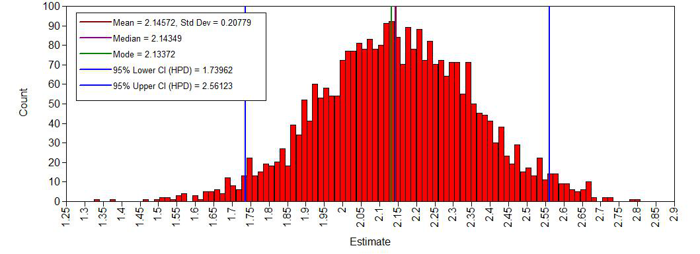

**histogram age^2** 


**histogram intercept** 
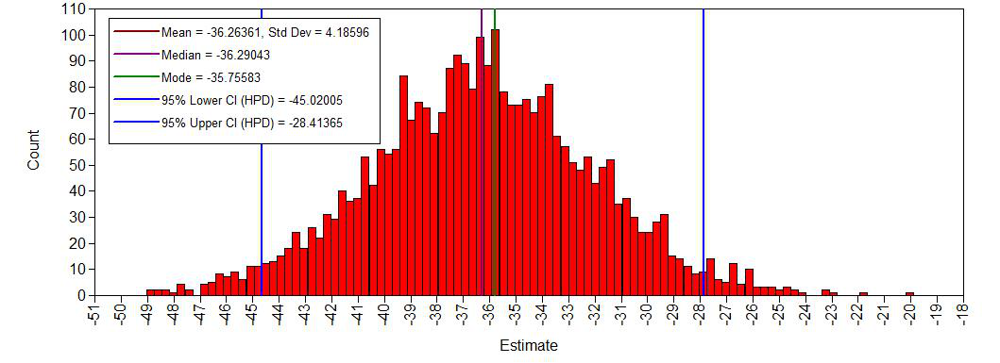 

**histogram error variance** 
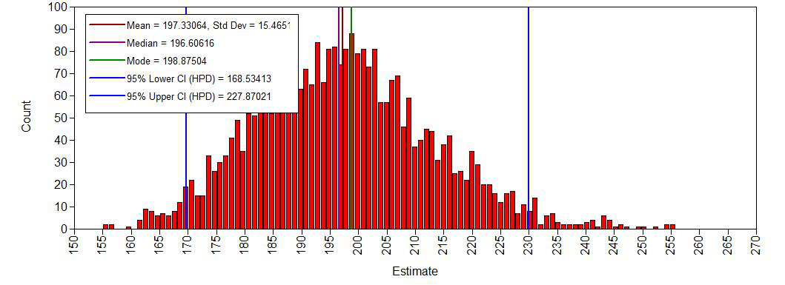

_The histograms look smooth and have no gaps or other abnormalities. Based on this, adding more iterations is not necessary. However, if you arenot satisfied, you can improve the number of iterations again. Posterior distributions do not have to be symmetrical, but in this example they seem to be.If we compare this with histograms based on the first analysis (with very few iterations), this difference becomes clear:_ 

**histogram age** 
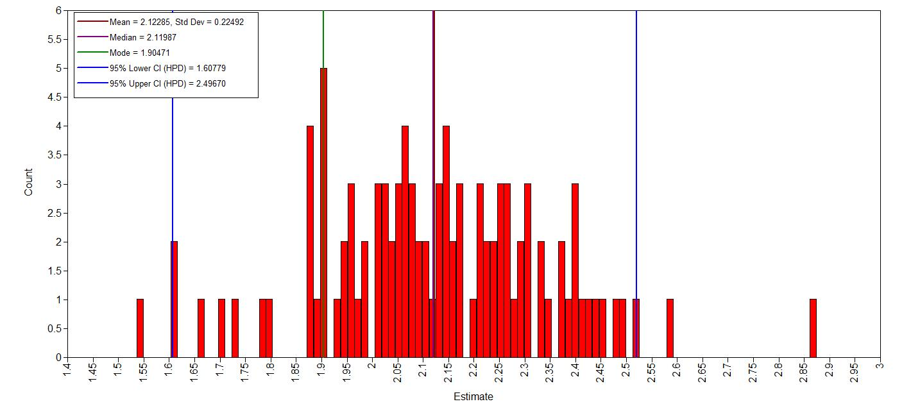

[/expand]


### 5.   Do the chains exhibit a strong degree of autocorrelation?


To obtain information about autocorrelations you can use (`Plot > View Plots >  Bayesian autocorrelation plots > view > select the parameter you would like to see the autocorrelation of > OK`)
  
  <p>&nbsp;</p>
  
_**Question:** What can you conclude about these autocorrelation plots?_

[expand title="Answer" trigclass="noarrow my_button" targclass="my_content" tag="button"]

_As an example the autocorrelation for the age regression coefficient:_

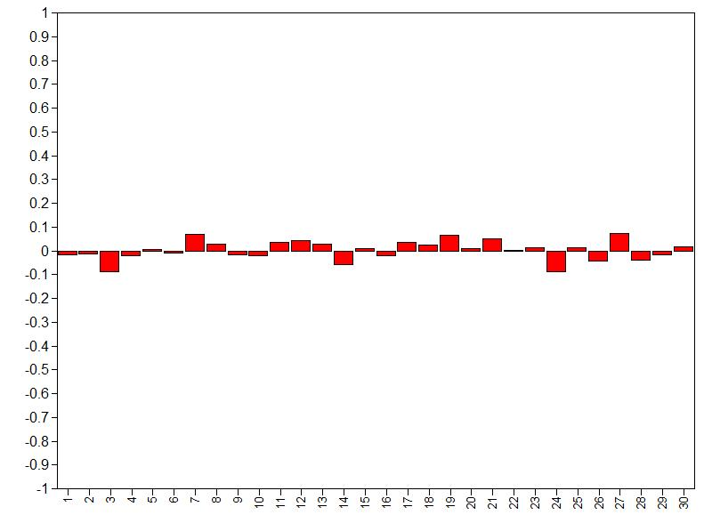

_Autocorrelation is relatively small over lags (largest absolute values is below .20), so we don't need more iterations. For more informtation on autocorrelation check this [paper](https://besjournals.onlinelibrary.wiley.com/doi/full/10.1111/j.2041-210X.2011.00131.x)._

[/expand]

  <p>&nbsp;</p>
  

### 6.   Do the posterior distributions make substantive sense?

We plot the posterior distributions and see if they are unimodel (one peak), if they are clearly centered around one value, if they give a realistic estimate and if they make substantive sense compared to our prior beliefs (priors). Here we plot the  posteriors of the regression coefficients. To plot the densities go to `Plot > View Plots >  Bayesian posterior parameter distributions > view > curve type: Kernel densinty > select the parameter you would like to see the density of > OK`
  <p>&nbsp;</p>
  

_**Question:** What is your conclusion; do the posterior distributions make sense?_

[expand title="Answer" trigclass="noarrow my_button" targclass="my_content" tag="button"]


The posterior density plots:

**Density posterior age** 
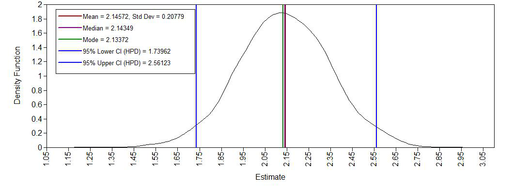 

**Density posterior age2** 
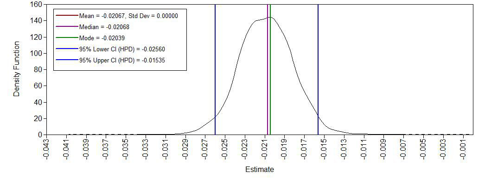

**Density posterior intercept** 
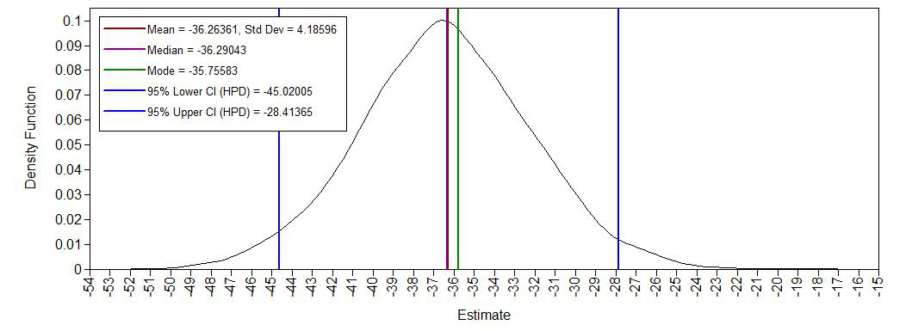

**Density posterior error variance** 
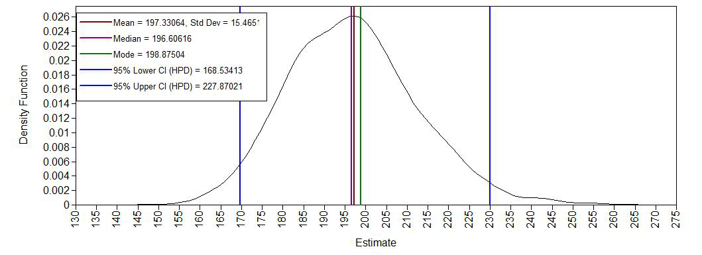

_Yes, we see a clear negative intercept, which makes sense since a value of age = 0 for Ph.D is impossible. We also have have plausible ranges of values for the regression coefficients and a positive variance._

[/expand]


## **step 3: Understanding the exact influence of the priors**


First we  check the results of the analysis with the priors we used so far.

```r
MODEL RESULTS

                                Posterior  One-Tailed         95% C.I.
                    Estimate       S.D.      P-Value   Lower 2.5%  Upper 2.5%  Significance

 DIFF       ON
    AGE                2.143       0.208      0.000       1.740       2.561      *
    AGE2              -0.021       0.003      0.000      -0.026      -0.015      *

 Intercepts
    DIFF             -36.290       4.187      0.000     -45.020     -28.414      *

 Residual Variances
    DIFF             196.606      15.468      0.000     168.534     227.870      *
```


### 7. Do different specification of the variance priors influence the results?

To understand how the prior on the residual variance impacts the posterior results, we compare the previous model with a model where different hyperparameters for the Inverse Gamma distribution are specified. To see what default priors Mplus uses we can have a look at the Appendix A of this [manual](https://www.statmodel.com/download/BayesAdvantages18.pdf): "The default for variance parameters, i.e., variance
covariance blocks of size 1 is $IG(-1,0)$". in the`TECH8`output this is summarized as:


```r
  PRIORS FOR ALL PARAMETERS            PRIOR MEAN      PRIOR VARIANCE     PRIOR STD. DEV.

     Parameter 4~IG(-1.000,0.000)          infinity            infinity            infinity
```

So far we have used the -$\in \sim IG(.5, .5)$ prior, but we can also use the -$\in \sim IG(.01, .01)$ prior and see if doing so makes a difference. To quantify this difference we again calculate a relative bias. We change the hyperparameters in the regression model that was specified in step 2 using the `~` command. After rerunning the analysis we can then calculate a bias to see the influence of different priors 

  <p>&nbsp;</p>
  

_**Question:** Are the results robust for different specifications of the prior on the residual variance (compute the relative bias)?_


| Parameters | Estimate with $\in \sim IG(.01, .01)$ | Estimate with $\in \sim IG(.5, .5)$ | Bias |
| ---               | ---                        | ---                       | ---  |
| Intercept         |                            |                           |      |
| Age               |                            |                           |      |
| Age2              |                            |                           |      |
| Residual variance |                            |                           |      |

[expand title="Answer" trigclass="noarrow my_button" targclass="my_content" tag="button"]

_Change this syntax_

```r
MODEL PRIORS:
  Beta_Age ~ N(.8, 5);
  Beta_Age2 ~ N(0, 10);
  intercept ~  N(-35, 20);
  e ~ IG(.01, .01);
```

**Part of Model results for `e ~ IG(.01, .01)`**

```r
MODEL RESULTS

                                
                    Estimate    
 DIFF       ON
    AGE                2.143      
    AGE2              -0.021       

 Intercepts
    DIFF             -36.287      

 Residual Variances
    DIFF             197.186      
```


```r
MODEL RESULTS

                                Posterior  One-Tailed         95% C.I.
                    Estimate       S.D.      P-Value   Lower 2.5%  Upper 2.5%  Significance

 DIFF       ON
    AGE                2.143       0.208      0.000       1.740       2.561      *
    AGE2              -0.021       0.003      0.000      -0.026      -0.015      *

 Intercepts
    DIFF             -36.290       4.187      0.000     -45.020     -28.414      *

 Residual Variances
    DIFF             196.606      15.468      0.000     168.534     227.870      *
```


| Parameters | Estimate with $\in \sim IG(.01, .01)$ | Estimate with $\in \sim IG(.5, .5)$ | Bias |
| ---        | ---                        | ---                       | ---  |
| Intercept  |  -36.287                    | -36.290                    | $100\cdot \frac{-36.287 --36.290  }{-36.290 } = -0.01%$    |
| Age        | 2.143                       |  2.143                     | 0    |
| Age2       |     -0.021                 | -0.021                    |0     |
| Residual variance | 197.186              | 196.606 | $100\cdot \frac{ 197.186 -196.606}{196.606} = 0.295\%$ |

_Yes, the results are robust, because there is only a really small amount of relative bias for the residual variance._

[/expand]

### 8.   Is there a notable effect of the prior when compared with non-informative priors?

To see what default priors Mplus uses we can have a look at the Appendix A of this [manual](https://www.statmodel.com/download/BayesAdvantages18.pdf). "The default prior for intercepts, regression slopes, and loading parameters is $\beta \sim \mathcal{N}(0, \infty)$." This means in practice that we have a normal prior with a super wide variance,  and allow probability mass across the entire parameter space. The default priors can also be found in the TECH8 output of Mplus


```r
   PRIORS FOR ALL PARAMETERS            PRIOR MEAN      PRIOR VARIANCE     PRIOR STD. DEV.

     Parameter 1~N(0.000,infinity)           0.0000            infinity            infinity
     Parameter 2~N(0.000,infinity)           0.0000            infinity            infinity
     Parameter 3~N(0.000,infinity)           0.0000            infinity            infinity
     Parameter 4~IG(-1.000,0.000)          infinity            infinity            infinity
```


  <p>&nbsp;</p>
  
_**Question**: What is your conclusion about the influence of the priors on the posterior results?_


To anwser this, rerun the model without the prior specifications in the input file and compute the relative bias.


| Parameters        | Estimates with default priors | Estimate with informative priors | Bias |
| ---               | ---                           | ---                              | ---  |
| Intercept         |                               |                                  |      |
| Age               |                               |                                  |      |
| Age2              |                               |                                  |      |
| Residual variance |                               |                                  |      |


[expand title="Answer" trigclass="noarrow my_button" targclass="my_content" tag="button"]

The estimates can once again be found in the `MODEL RESULTS` table


```r
MODEL RESULTS

                               
                    Estimate      

 DIFF       ON
    AGE                2.672       
    AGE2              -0.026       

 Intercepts
    DIFF             -47.409      

 Residual Variances
    DIFF             198.461    
```


| Parameters | Estimates with default priors | Estimate with informative priors | Bias|
| --- | --- | --- | --- |
| Intercept | -47.41|   -36.29  | $100\cdot \frac{ -47.41 --36.29}  { -36.29} = 30.64\%$ |
| Age |  2.67 | 2.14 | $100\cdot \frac{  2.67-2.14}{  2.14} = 24.77\%$ |
| Age2 | -0.026 | -0.021 |$100\cdot \frac{ -0.026 --0.021 }{ -0.021 } = 23.81\%$ |
| Residual variance | 198.46| 197.19 | $100\cdot \frac{ 198.46-197.19}{ 197.19} = 0.64\%$ |

_The informative priors have quite some influence (up to 30%) on the posterior results of the regression coefficients. This is not a bad thing, just important to keep in mind._ 


[/expand]

  <p>&nbsp;</p>
  
  
### 9.   Are the results stable from a sensitivity analysis?
If you still have time left, you can adjust the hyperparameters of the priors upward and downward and re-estimating the model with these varied priors to check for robustness.

From the original paper:

> "If informative or weakly-informative priors are used, then we suggest running a sensitivity analysis of these priors. When subjective priors are in place, then there might be a discrepancy between results using different subjective prior settings. A sensitivity analysis for priors would entail adjusting the entire prior distribution (i.e., using a completely different prior distribution than before) or adjusting hyperparameters upward and downward and re-estimating the model with these varied priors. Several different hyperparameter specifications can be made in a sensitivity analysis, and results obtained will point toward the impact of small fluctuations in hyperparameter values. [...] The purpose of this sensitivity analysis is to assess how much of an impact the location of the mean hyperparameter for the prior has on the posterior. [...] Upon receiving results from the sensitivity analysis, assess the impact that fluctuations in the hyperparameter values have on the substantive conclusions. Results may be stable across the sensitivity analysis, or they may be highly instable based on substantive conclusions. Whatever the finding, this information is important to report in the results and discussion sections of a paper. We should also reiterate here that original priors should not be modified, despite the results obtained."


For more information on this topic, please also refer to this [paper](http://psycnet.apa.org/record/2017-52406-001). 

### 10.   Is the Bayesian way of interpreting and reporting model results used?


For a summary on how to interpret and report models, please refer to https://www.rensvandeschoot.com/bayesian-analyses-where-to-start-and-what-to-report/


```r
MODEL RESULTS

                                Posterior  One-Tailed         95% C.I.
                    Estimate       S.D.      P-Value   Lower 2.5%  Upper 2.5%  Significance

 DIFF       ON
    AGE                2.143       0.208      0.000       1.740       2.561      *
    AGE2              -0.021       0.003      0.000      -0.026      -0.015      *

 Intercepts
    DIFF             -36.290       4.187      0.000     -45.020     -28.414      *

 Residual Variances
    DIFF             196.606      15.468      0.000     168.534     227.870      *
```


In the current model we see that:

*  The estimate for the intercept is  -36.29 [-45.02;  -28.41]
*  The estimate for the effect of $age$  is  2.14 [1.74 ; 2.56]
*  The estimate for the effect of $age^2$  is -0.021 [-0.026; -0.015]

We can see that none of 95% Posterior HPD Intervals for these effects include zero, which means we are can be quite certain that all of the effects are different from 0. Futhermore, yhe third column of the `MODEL RESULTS` table gives the  one-tailed p-value based on the posterior distribution. For a positive estimate, the p-value is the proportion of the posterior distribution that is below zero. For a negative estimate, the p-value is the proportion of the posterior distribution that is above zero. So the a p- value of 0.000 means a probability is around >.999 that the corresponding parameter is not 0.

  <p>&nbsp;</p>
  
---

**References**

Depaoli, S., &amp; Van de Schoot, R. (2017). Improving transparency and replication in Bayesian statistics: The WAMBS-Checklist. _Psychological Methods_, _22_(2), 240.

Link, W. A., & Eaton, M. J. (2012). On thinning of chains in MCMC. _Methods in ecology and evolution_, _3_(1), 112-115.

van Erp, S., Mulder, J., & Oberski, D. L. (2017). Prior sensitivity analysis in default Bayesian structural equation modeling.

Van de Schoot, R., &amp; Depaoli, S. (2014). Bayesian analyses: Where to start and what to report. _European Health Psychologist_, _16_(2), 75-84.


