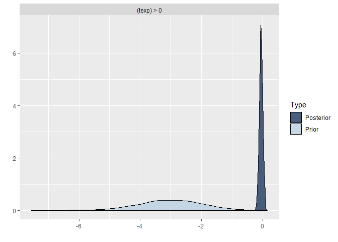
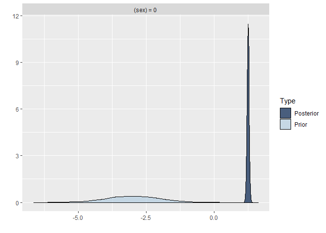
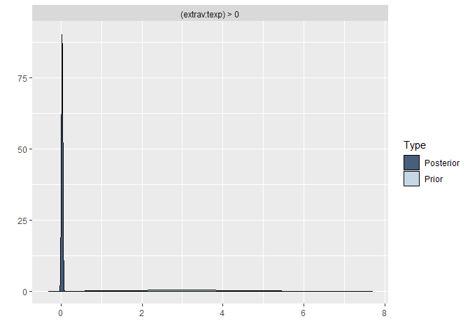
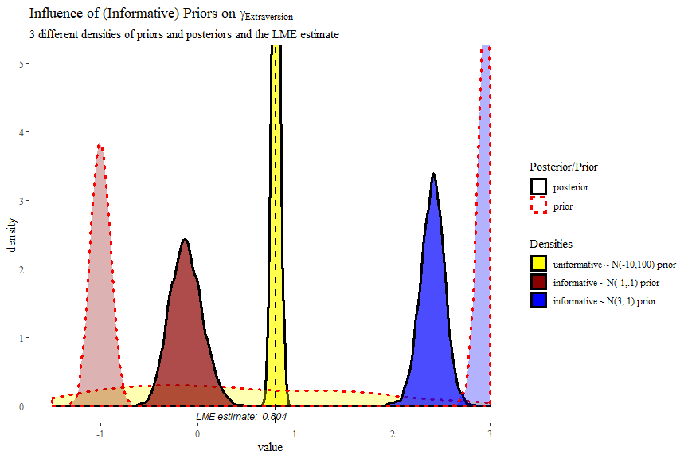

## Introduction

**This is part 2 of a 3 part  [series](https://www.rensvandeschoot.com/tutorials/brms/) on how to do multilevel models in the Bayesian framework. In [part 1](https://www.rensvandeschoot.com/tutorials/brms-started/) we explained how to step by step build the multilevel model we will use here and in  [part 3](https://www.rensvandeschoot.com/brms-wambs/) we will look at the influence of different priors  ** 


## Preparation
This tutorial expects:

-  Basic knowledge of multilevel analyses (first two chapters of the book are sufficient).
-  Basic knowledge of coding in R, specifically the [LME4 package](https://www.rensvandeschoot.com/tutorials/lme4/).
-  Basic knowledge of Bayesian Statistics.
- Installation of [STAN](https://mc-stan.org/users/interfaces/rstan) and [Rtools](https://cran.r-project.org/bin/windows/Rtools). For more information please see https://github.com/stan-dev/rstan/wiki/RStan-Getting-Started
- Installation of R packages `rstan`, and `brms`. This tutorial was made using brms version 2.8.0 in R version 3.6.0
- Basic knowledge of [Bayesian](https://www.rensvandeschoot.com/a-gentle-introduction-to-bayesian-analysis-applications-to-developmental-research/) inference


## priors
As stated in the BRMS manual: *"Prior specifications are flexible and explicitly encourage users to apply prior distributions that actually reflect their beliefs."* 

We will set 4 types of extra priors here (in a addition to the uninformative prior we have used thus far)
1.  With an estimate far off the value we found in the data with uninformative priors with a wide variance
2.  With an estimate close to the value we found in the data with uninformative priors with a small variance
3.  With an estimate far off the value we found in the data with uninformative priors with a small variance (1).
4.  With an estimate far off the value we found in the data with uninformative priors with a small variance (2).

In this tutorial we will only focus on priors for the regression coefficients and not on the error and variance terms, since we are most likely to actually have information on the size and direction of a certain effect and less (but not completely) unlikely to have prior knowledge on the unexplained variances. You might have to play around a little bit with the controls of the brm function and specifically the adapt_delta and  max_treedepth. Thankfully BRMS will tell you when to do so. We can also did not set highly informative priors for all regression coefficients at once, because this leads to the blowing up of estimates convergence issues (potentially solvable by just running many more iterations)


## STEP 1: setting up packages
n order to make the [brms package](https://cran.r-project.org/web/packages/brms/index.html) function it need to call on STAN and a C++ compiler. For more information and a tutorial on how to install these please have a look at: https://github.com/stan-dev/rstan/wiki/RStan-Getting-Started and https://cran.r-project.org/bin/windows/Rtools/.

> "Because brms is based on Stan, a C++ compiler is required. The program Rtools (available on https://cran.r-project.org/bin/windows/Rtools/) comes with a C++ compiler for Windows. On Mac, you should use Xcode. For further instructions on how to get the compilers running, see the prerequisites section at the RStan-Getting-Started page." ~ quoted from the  BRMS package document

After you have install the aforementioned software you need to load some other R packages. If you have not yet installed all below mentioned packages, you can install them by the command install.packages("NAMEOFPACKAGE")


```r
library(brms) # for the analysis
library(haven) # to load the SPSS .sav file
library(tidyverse) # needed for data manipulation.
library(RColorBrewer) # needed for some extra colours in one of the graphs
library(ggmcmc)
library(ggthemes)
library(lme4)
```


&nbsp;
# Step 2: Downloading the data

The popularity dataset contains characteristics of pupils in different classes. The main goal of this tutorial is to find models and test hypotheses about the relation between these characteristics and the popularity of pupils (according to their classmates). To download the popularity data go to https://multilevel-analysis.sites.uu.nl/datasets/ and follow the links to https://github.com/MultiLevelAnalysis/Datasets-third-edition-Multilevel-book/blob/master/chapter%202/popularity/SPSS/popular2.sav. We will use the .sav file which can be found in the SPSS folder. After downloading the data to your working directory you can open it with the read_sav() command.

Alternatively, you can directly download them from GitHub into your R work space using the following command:


```r
popular2data <- read_sav(file ="https://github.com/MultiLevelAnalysis/Datasets-third-edition-Multilevel-book/blob/master/chapter%202/popularity/SPSS/popular2.sav?raw=true")
```

There are some variables in the dataset that we do not use, so we can select the variables we will use and have a look at the first few observations.


```r
popular2data <- select(popular2data, pupil, class, extrav, sex, texp, popular) # we select just the variables we will use
head(popular2data) # we have a look at the first 6 observations
```

```
## # A tibble: 6 x 6
##   pupil class extrav       sex  texp popular
##   <dbl> <dbl>  <dbl> <dbl+lbl> <dbl>   <dbl>
## 1     1     1      5  1 [girl]    24     6.3
## 2     2     1      7  0 [boy]     24     4.9
## 3     3     1      4  1 [girl]    24     5.3
## 4     4     1      3  1 [girl]    24     4.7
## 5     5     1      5  1 [girl]    24     6  
## 6     6     1      4  0 [boy]     24     4.7
```


## The Effect of Priors
With the get_prior() command we can see which priors we can specify for this model. 


```r
get_prior(popular~1 + sex + extrav + texp + extrav:texp + (1 + extrav | class), data = popular2data)
```

```
##                  prior     class        coef group resp dpar nlpar bound
## 1                              b                                        
## 2                              b      extrav                            
## 3                              b extrav:texp                            
## 4                              b         sex                            
## 5                              b        texp                            
## 6               lkj(1)       cor                                        
## 7                            cor             class                      
## 8  student_t(3, 5, 10) Intercept                                        
## 9  student_t(3, 0, 10)        sd                                        
## 10                            sd             class                      
## 11                            sd      extrav class                      
## 12                            sd   Intercept class                      
## 13 student_t(3, 0, 10)     sigma
```

For the first model with priors we just set normal priors for all regression coefficients, in reality many, many more prior distributions are possible, see the [BRMS manual](https://cran.r-project.org/web/packages/brms/brms.pdf) for an overview.

```r
prior1 <- c(set_prior("normal(-10,100)", class = "b", coef = "extrav"),
            set_prior("normal(10,100)", class = "b", coef = "extrav:texp"),
            set_prior("normal(-5,100)", class = "b", coef = "sex"),
            set_prior("normal(-5,100)", class = "b", coef = "texp"),
            set_prior("normal(10,100)", class = "Intercept"))
```


```r
model6 <- brm(popular ~ 1 + sex + extrav + texp + extrav:texp + (1 + extrav|class), 
              data  = popular2data, warmup = 1000,
              iter  = 3000, chains = 2, 
              prior = prior1,
              seed  = 123, control = list(adapt_delta = 0.97),
              cores = 2,
              sample_prior = TRUE) # to reach a usuable number effective samples in the posterior distribution of the interaction effect, we need many more iteration. This sampler will take quite some time and you might want to run it with a few less iterations.
```

To see which priors were inserted, use the prior_summary() command

```r
prior_summary(model6)
```

```
##                   prior     class        coef group resp dpar nlpar bound
## 1                               b                                        
## 2       normal(-10,100)         b      extrav                            
## 3        normal(10,100)         b extrav:texp                            
## 4        normal(-5,100)         b         sex                            
## 5        normal(-5,100)         b        texp                            
## 6        normal(10,100) Intercept                                        
## 7  lkj_corr_cholesky(1)         L                                        
## 8                               L             class                      
## 9   student_t(3, 0, 10)        sd                                        
## 10                             sd             class                      
## 11                             sd      extrav class                      
## 12                             sd   Intercept class                      
## 13  student_t(3, 0, 10)     sigma
```


We can also check the STAN code that is being used to run this model by using the stancode() command, here we also see the priors being implemented. This might help you understand the model a bit more, but is not necessary


```r
stancode(model6)
```

```
## // generated with brms 2.8.0
## functions {
## }
## data {
##   int<lower=1> N;  // number of observations
##   vector[N] Y;  // response variable
##   int<lower=1> K;  // number of population-level effects
##   matrix[N, K] X;  // population-level design matrix
##   // data for group-level effects of ID 1
##   int<lower=1> N_1;
##   int<lower=1> M_1;
##   int<lower=1> J_1[N];
##   vector[N] Z_1_1;
##   vector[N] Z_1_2;
##   int<lower=1> NC_1;
##   int prior_only;  // should the likelihood be ignored?
## }
## transformed data {
##   int Kc = K - 1;
##   matrix[N, K - 1] Xc;  // centered version of X
##   vector[K - 1] means_X;  // column means of X before centering
##   for (i in 2:K) {
##     means_X[i - 1] = mean(X[, i]);
##     Xc[, i - 1] = X[, i] - means_X[i - 1];
##   }
## }
## parameters {
##   vector[Kc] b;  // population-level effects
##   real temp_Intercept;  // temporary intercept
##   real<lower=0> sigma;  // residual SD
##   vector<lower=0>[M_1] sd_1;  // group-level standard deviations
##   matrix[M_1, N_1] z_1;  // unscaled group-level effects
##   // cholesky factor of correlation matrix
##   cholesky_factor_corr[M_1] L_1;
## }
## transformed parameters {
##   // group-level effects
##   matrix[N_1, M_1] r_1 = (diag_pre_multiply(sd_1, L_1) * z_1)';
##   vector[N_1] r_1_1 = r_1[, 1];
##   vector[N_1] r_1_2 = r_1[, 2];
## }
## model {
##   vector[N] mu = temp_Intercept + Xc * b;
##   for (n in 1:N) {
##     mu[n] += r_1_1[J_1[n]] * Z_1_1[n] + r_1_2[J_1[n]] * Z_1_2[n];
##   }
##   // priors including all constants
##   target += normal_lpdf(b[1] | -5,100);
##   target += normal_lpdf(b[2] | -10,100);
##   target += normal_lpdf(b[3] | -5,100);
##   target += normal_lpdf(b[4] | 10,100);
##   target += normal_lpdf(temp_Intercept | 10,100);
##   target += student_t_lpdf(sigma | 3, 0, 10)
##     - 1 * student_t_lccdf(0 | 3, 0, 10);
##   target += student_t_lpdf(sd_1 | 3, 0, 10)
##     - 2 * student_t_lccdf(0 | 3, 0, 10);
##   target += normal_lpdf(to_vector(z_1) | 0, 1);
##   target += lkj_corr_cholesky_lpdf(L_1 | 1);
##   // likelihood including all constants
##   if (!prior_only) {
##     target += normal_lpdf(Y | mu, sigma);
##   }
## }
## generated quantities {
##   // actual population-level intercept
##   real b_Intercept = temp_Intercept - dot_product(means_X, b);
##   corr_matrix[M_1] Cor_1 = multiply_lower_tri_self_transpose(L_1);
##   vector<lower=-1,upper=1>[NC_1] cor_1;
##   // additionally draw samples from priors
##   real prior_b_1 = normal_rng(-5,100);
##   real prior_b_2 = normal_rng(-10,100);
##   real prior_b_3 = normal_rng(-5,100);
##   real prior_b_4 = normal_rng(10,100);
##   real prior_sigma = student_t_rng(3,0,10);
##   real prior_sd_1 = student_t_rng(3,0,10);
##   real prior_cor_1 = lkj_corr_rng(M_1,1)[1, 2];
##   // extract upper diagonal of correlation matrix
##   for (k in 1:M_1) {
##     for (j in 1:(k - 1)) {
##       cor_1[choose(k - 1, 2) + j] = Cor_1[j, k];
##     }
##   }
##   // use rejection sampling for truncated priors
##   while (prior_sigma < 0) {
##     prior_sigma = student_t_rng(3,0,10);
##   }
##   while (prior_sd_1 < 0) {
##     prior_sd_1 = student_t_rng(3,0,10);
##   }
## }
```

After this model with uninformative priors, it's time to do the analysis with informative priors. Three models with different priors are tested and compared to investigate the influence of the construction of priors on the posterior distributions and therefore on the results in general.


```r
prior2 <- c(set_prior("normal(.8,.1)", class = "b", coef = "extrav"),
            set_prior("normal(-.025,.1)", class = "b", coef = "extrav:texp"),
            set_prior("normal(1.25,.1)", class = "b", coef = "sex"),
            set_prior("normal(.23,.1)", class = "b", coef = "texp"),
            set_prior("normal(-1.21,.1)", class = "Intercept"))

model7 <- brm(popular ~ 1 + sex + extrav + texp + extrav:texp + (1 + extrav|class), 
              data  = popular2data, warmup = 1000,
              iter  = 3000, chains = 2, 
              prior = prior2,
              seed  = 123, control = list(adapt_delta = 0.97),
              cores = 2,
              sample_prior = TRUE)
```


```r
summary(model7)
```

```
##  Family: gaussian 
##   Links: mu = identity; sigma = identity 
## Formula: popular ~ 1 + sex + extrav + texp + extrav:texp + (1 + extrav | class) 
##    Data: popular2data (Number of observations: 2000) 
## Samples: 2 chains, each with iter = 3000; warmup = 1000; thin = 1;
##          total post-warmup samples = 4000
## 
## Group-Level Effects: 
## ~class (Number of levels: 100) 
##                       Estimate Est.Error l-95% CI u-95% CI Eff.Sample Rhat
## sd(Intercept)             6.28      0.52     5.31     7.36        265 1.01
## sd(extrav)                0.08      0.04     0.01     0.19        457 1.00
## cor(Intercept,extrav)    -0.06      0.57    -0.95     0.92       2444 1.00
## 
## Population-Level Effects: 
##             Estimate Est.Error l-95% CI u-95% CI Eff.Sample Rhat
## Intercept      -7.39      1.05    -9.44    -5.32        236 1.00
## sex             1.23      0.03     1.17     1.30       6725 1.00
## extrav          0.81      0.06     0.68     0.94       2455 1.00
## texp            0.23      0.07     0.09     0.37        208 1.01
## extrav:texp    -0.02      0.00    -0.03    -0.02       4707 1.00
## 
## Family Specific Parameters: 
##       Estimate Est.Error l-95% CI u-95% CI Eff.Sample Rhat
## sigma     0.74      0.01     0.72     0.77       2937 1.00
## 
## Samples were drawn using sampling(NUTS). For each parameter, Eff.Sample 
## is a crude measure of effective sample size, and Rhat is the potential 
## scale reduction factor on split chains (at convergence, Rhat = 1).
```


```r
prior3 <- c(set_prior("normal(-1,.1)", class = "b", coef = "extrav"),
            set_prior("normal(3, 1)", class = "b", coef = "extrav:texp"),
            set_prior("normal(-3,1)", class = "b", coef = "sex"),
            set_prior("normal(-3,1)", class = "b", coef = "texp"),
            set_prior("normal(0,5)", class = "Intercept"))

model8 <- brm(popular ~ 1 + sex + extrav + texp + extrav:texp + (1 + extrav|class), 
              data  = popular2data, warmup = 1000,
              iter  = 3000, chains = 2, 
              prior = prior3,
              seed  = 123, control = list(adapt_delta = 0.97),
              cores = 2,
              sample_prior = TRUE)
```


```r
summary(model8)
```

```
##  Family: gaussian 
##   Links: mu = identity; sigma = identity 
## Formula: popular ~ 1 + sex + extrav + texp + extrav:texp + (1 + extrav | class) 
##    Data: popular2data (Number of observations: 2000) 
## Samples: 2 chains, each with iter = 3000; warmup = 1000; thin = 1;
##          total post-warmup samples = 4000
## 
## Group-Level Effects: 
## ~class (Number of levels: 100) 
##                       Estimate Est.Error l-95% CI u-95% CI Eff.Sample Rhat
## sd(Intercept)             2.26      0.40     1.52     3.08        258 1.01
## sd(extrav)                0.42      0.08     0.27     0.56        288 1.01
## cor(Intercept,extrav)    -0.97      0.01    -0.99    -0.93        359 1.01
## 
## Population-Level Effects: 
##             Estimate Est.Error l-95% CI u-95% CI Eff.Sample Rhat
## Intercept       3.83      0.90     2.09     5.60        278 1.00
## sex             1.25      0.04     1.18     1.33       6262 1.00
## extrav         -0.14      0.16    -0.45     0.19        310 1.01
## texp           -0.07      0.05    -0.17     0.04        260 1.00
## extrav:texp     0.03      0.01     0.01     0.05        296 1.00
## 
## Family Specific Parameters: 
##       Estimate Est.Error l-95% CI u-95% CI Eff.Sample Rhat
## sigma     0.74      0.01     0.72     0.77       5922 1.00
## 
## Samples were drawn using sampling(NUTS). For each parameter, Eff.Sample 
## is a crude measure of effective sample size, and Rhat is the potential 
## scale reduction factor on split chains (at convergence, Rhat = 1).
```


```r
prior4 <- c(set_prior("normal(3,.1)", class = "b", coef = "extrav"),
            set_prior("normal(-3,1)", class = "b", coef = "extrav:texp"),
            set_prior("normal(3,1)", class = "b", coef = "sex"),
            set_prior("normal(3,1)", class = "b", coef = "texp"),
            set_prior("normal(0,5)", class = "Intercept"))


model9 <- brm(popular ~ 1 + sex + extrav + texp + extrav:texp + (1 + extrav|class), 
              data  = popular2data, warmup = 1000,
              iter  = 3000, chains = 2, 
              prior = prior4,
              seed  = 123, control = list(adapt_delta = 0.97),
              cores = 2,
              sample_prior = TRUE)
```


```r
summary(model9)
```

```
##  Family: gaussian 
##   Links: mu = identity; sigma = identity 
## Formula: popular ~ 1 + sex + extrav + texp + extrav:texp + (1 + extrav | class) 
##    Data: popular2data (Number of observations: 2000) 
## Samples: 2 chains, each with iter = 3000; warmup = 1000; thin = 1;
##          total post-warmup samples = 4000
## 
## Group-Level Effects: 
## ~class (Number of levels: 100) 
##                       Estimate Est.Error l-95% CI u-95% CI Eff.Sample Rhat
## sd(Intercept)             3.69      0.45     2.87     4.63        370 1.00
## sd(extrav)                0.70      0.08     0.56     0.86        587 1.00
## cor(Intercept,extrav)    -0.99      0.00    -0.99    -0.98        466 1.00
## 
## Population-Level Effects: 
##             Estimate Est.Error l-95% CI u-95% CI Eff.Sample Rhat
## Intercept      -9.81      0.84   -11.50    -8.25        418 1.00
## sex             1.25      0.04     1.18     1.32       6126 1.00
## extrav          2.44      0.12     2.20     2.67       1102 1.00
## texp            0.72      0.05     0.62     0.83        458 1.00
## extrav:texp    -0.12      0.01    -0.14    -0.10        744 1.00
## 
## Family Specific Parameters: 
##       Estimate Est.Error l-95% CI u-95% CI Eff.Sample Rhat
## sigma     0.74      0.01     0.72     0.77       5926 1.00
## 
## Samples were drawn using sampling(NUTS). For each parameter, Eff.Sample 
## is a crude measure of effective sample size, and Rhat is the potential 
## scale reduction factor on split chains (at convergence, Rhat = 1).
```


Comparing the last three models we see that for the first two models the prior specification does not really have a large influence on the results. However, for the final model with the highly informative priors that are far from the observed data, the priors do influence the posterior results. Because of the fairly large dataset, the priors are unlikely to have a large influence unless they are highly informative. Because we asked to save the prior in the last model ("sample_prior = TRUE"), we can now plot the difference between the prior and the posterior distribution of different parameters. In all cases we see that the prior has a large influence on the posterior compared to the posterior estimates we arrived in earlier models.


```r
plot(hypothesis(model8, "texp > 0")) # if you would just run this command without the plot wrapper, you would get the support for the hypothesis that the regression coefficient texp is larger than 0, this is in interesting way to test possible hypothesis you had.
```

<!-- -->

```r
plot(hypothesis(model8, "sex = 0"))
```

<!-- -->

```r
plot(hypothesis(model8, "extrav >0"))
```

<!-- -->

```r
plot(hypothesis(model8, "extrav:texp>0"))
```

<!-- -->


```r
posterior1 <- posterior_samples(model6, pars = "b_extrav")[, c(1,3)]
posterior2 <- posterior_samples(model8, pars = "b_extrav")[, c(1,3)]
posterior3 <- posterior_samples(model9, pars = "b_extrav")[, c(1,3)]

posterior1.2.3 <- bind_rows("prior 1" = gather(posterior1),
                            "prior 2" = gather(posterior2), 
                            "prior 3" = gather(posterior3), 
                            .id = "id")
modelLME <- lmer(popular ~ 1 + sex + extrav + texp + extrav:texp + (1 + extrav | class), data = popular2data)

ggplot(data    = posterior1.2.3, 
       mapping = aes(x        = value,
                     fill     =  id, 
                     colour   = key,
                     linetype = key, 
                     alpha    = key)) +
  geom_density(size = 1.2)+
  geom_vline(xintercept = summary(modelLME)$coefficients["extrav", "Estimate"], # add the frequentist solution too
             size = .8, linetype = 2, col = "black")+ 
  scale_x_continuous(limits = c(-1.5, 3))+
  coord_cartesian(ylim = c(0, 5))+
  scale_fill_manual(name   = "Densities", 
                    values = c("Yellow","darkred","blue" ), 
                    labels = c("uniformative ~ N(-10,100) prior",
                              "informative ~ N(-1,.1) prior",
                              "informative ~ N(3,.1) prior") )+
  scale_colour_manual(name   = 'Posterior/Prior', 
                      values = c("black","red"), 
                      labels = c("posterior", "prior"))+
  scale_linetype_manual(name   ='Posterior/Prior', 
                        values = c("solid","dotted"), 
                        labels = c("posterior", "prior"))+
  scale_alpha_discrete(name   = 'Posterior/Prior', 
                       range  = c(.7,.3), 
                       labels = c("posterior", "prior"))+
  annotate(geom    = "text", 
           x = 0.45, y = -.13,
           label  = "LME estimate:  0.804", 
           col    = "black", 
           family = theme_get()$text[["family"]], 
           size   = theme_get()$text[["size"]]/3.5, 
           fontface="italic")+
  labs(title    = expression("Influence of (Informative) Priors on" ~ gamma[Extraversion]),
       subtitle = "3 different densities of priors and posteriors and the LME estimate")+
  theme_tufte()
```

```
## Warning: Using alpha for a discrete variable is not advised.
```

```
## Warning: Removed 5906 rows containing non-finite values (stat_density).
```

<!-- -->

In this plot we can clearly see how the informative priors pull the posteriors towards them, while the the uninformarive prior yields a posterior that is centered around what would be the frequentist (LME4) estimate. 

---
#### Brms Reference

[Burkner, P. C. (2017). brms: An R package for Bayesian multilevel models using Stan. Journal of Statistical Software, 80(1), 1-28.](https://www.jstatsoft.org/article/view/v080i01)
---
